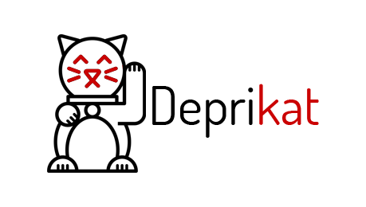

[](https://www.npmjs.com/package/deprikat)


[](https://travis-ci.org/alvaropinot/deprikat.svg)
[](https://codeclimate.com/github/alvaropinot/deprikat/coverage)
[](https://codeclimate.com/github/alvaropinot/deprikat)


# deprikat
deprikat - deprecation tags analyser with usage lookup.



## Roadmap

* [ ] Allow multiple configurable tags
* [ ] Detect variable declarations
* [ ] Humanize output
* [ ] suggestion using `@see`


## Ideas
use `warnings.length` for exit code

```js
process.exit(warnings.length)
```

# Author
Alvaro Pinot - MIT

Logo - Lucky Cat by Maria Darron from txhe Noun Project
